### `Senior Software Developer`

## `// about`

I do automations, integrations, that sort of thing. Plus whatever I'm told to.

## `// stack`

&nbsp;
&nbsp;
&nbsp;
&nbsp;
 
&nbsp;
&nbsp;
&nbsp;
&nbsp;

## `// activity`

